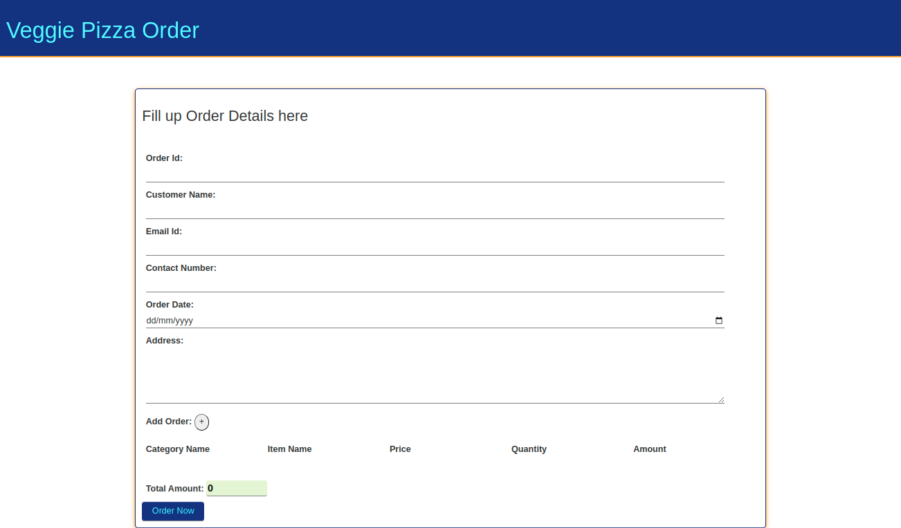
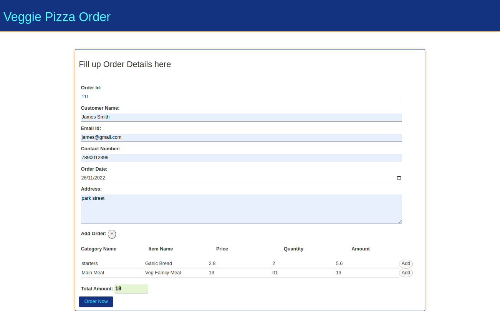
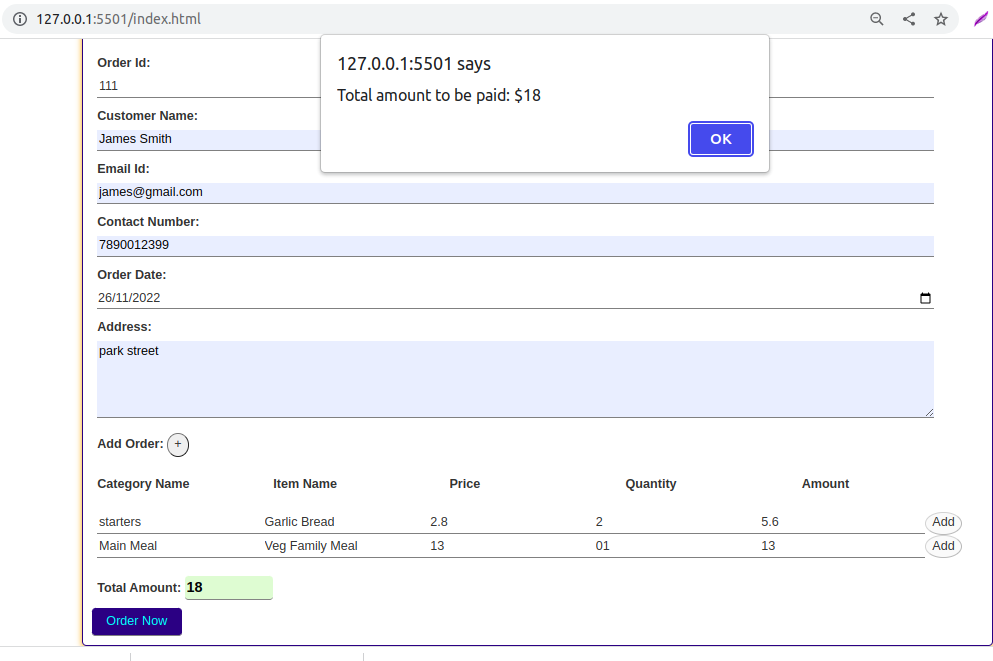

## Challenge - Create an order form and save the order details for the Veggie Pizza outlet

## Problem Statement

Veggie Pizza is a pizza delivery outlet that became popular for its custom-made vegetarian pizzas. A customer can order pizzas and other items by calling the outlet. The outlet delivers the order to the address specified by each customer.​
The outlet now have an app that allows the call operator to enter the order details and store them.​
Write a JS program to create an order form with validations, to add order items dynamically, to save the order details ​and calculate the total bill amount payable.​

### Tasks

The challenge can be performed by the following steps:​

#### Step 1 – Create Order Form With Validations​

- Open `index.html` file inside `solution` folder to create an HTML form.​
- An order form should be created with the fields and validations as listed in the table below.​
- Error messages should be displayed for the field inputs that do not fulfil the validation criteria. 
- Forms with invalid inputs should not get submitted.​

| Input Field​          | Validation​                                                      |
| --------------------- | ---------------------------------------------------------------- |
| Order Id​             | Should not be left blank​                                        |
| Order Date​           | Should be in correct date format​      |
| Customer Name​        | Should not be left blank                       |
|  Email Id      | Should not be left blank and should allow input of type email​   |
| Contact Number      | Should not be left blank  and  takes only 10 digitted number​​                                         |
| Customer Address​ | Should not be left blank and should have minimum 10 characters                                      |
| Order Amount​         | Should be non-editable and get updated as order items are added​ |

Dynamically Added Form Fields

| Input Field​          | Validation​                                                      |
| --------------------- | ---------------------------------------------------------------- |
| Category​  | Should not be left blank​                                                |
| Item Name​ | Should not be left blank​                                                |
| Price​     | Should not be left blank and should allow only numbers. Default value should be 0​  ​     |
| Quantity​  | Should not be left blank and should allow only numbers. Default value should be 0​                  |
|Total Amount​    | Should be non-editable and get updated as price or quantity are updated. Default value should be 0​​ |

#### Expected Output: For Reference

#### Step 2 – Add Order Items Dynamically

- Inside `index.html` file, add a button with the “+” icon in th order form.​
- Open the `script.js` file inside the `solution/js` folder to add JavaScript code.​
- Write a JS function such that when the user clicks the "+" button, input fields should get added dynamically, allowing the user to input order item details such as:

   * Category – could be an input field that allows the user to input category.​

  * Item name –  could be an input field that allows the user to input menu item.​

  * Price – could be an input field that allows only numbers to be inputted.

  * Quantity – could be a input field that allows only numbers to be inputted.​

  * Amount – could be a read-only field that displays the total amount whenever the price or quantity is updated.​

  * Add button  – Associate with click event listener programmatically to handle the click event.​

#### Expected Output: For Reference

#### Step 3 – Calculate Total Bill Amount​

- As the user enters order items and click the "add" button,​
    - The text field for “Total Bill Amount” should get updated with the sum of the amount of all order items.​
    - Save the ordered items in an array​
    - Make all fields read-only​
    - Disable the active state of the "add" button

**Note: The field should not be editable and should display the value as "0" initially.**

#### Step 4 – Save Order With a Successful Message

- Create a JavaScript function to save the order details.​
- Upon clicking the “Save Order” button, capture the order details and store it in an array.​
- Confirm the successful completion of the transaction by returning the following message :

    `Total amount to be paid: <totalAmount>`

#### Expected Output: For Reference

### General Instructions 

- Write the code in `script.js` under `solution/js` folder.
- Write the style in `style.css` under `solution/css` folder to provide custom styles for the form.
- Open the `index.html` file using Live Server and test the output.​​
​

### Submission Instructions

1. This is a test enabled challenge, hence, the solution will have to undergo automated evaluation process. 
    - For automated evaluation, the solution should be first tested locally and then on hobbes.
2. Steps to test the code locally:
    1. Ensure the solution code is provided in the specified files only.
    2. From the command line terminal, set the path to the folder containing cloned boilerplate code.
    3. Run the command `npm install` to install the dependencies.
    4. Run the command `npm run test` to test the solution locally.
    5. Ensure all the test cases are passing locally and then push the solution to git for automated testing on `hobbes`.
3. Steps to test the code on hobbes:
    1. Open the submission page at `https://codereview.stackroute.niit.com/#/submission`.
    2. Submit the solution.
    3. For the failed test cases, refactor the code locally and submit it for re-evaluation.
​
